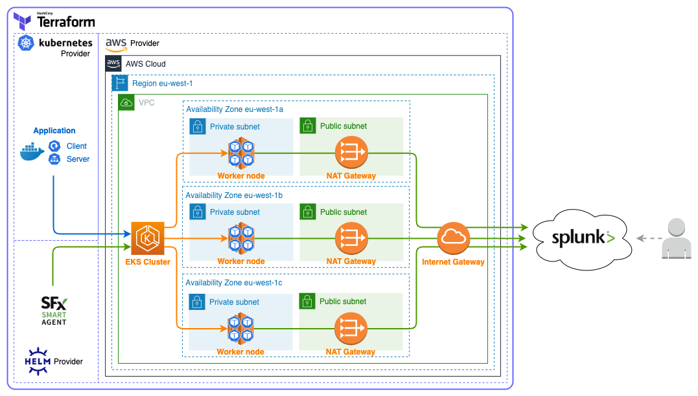

# K8s Splunk

This project shows how to deploy a Kubernetes cluster to AWS using EKS (Elastic Kubernetes Service), along with its workload and the Splunk Infrastructure Monitoring agent for observability, all in a single Terraform stack.

## Architecture overview



## Kubernetes workload


## Usage

### Requirements

- [Docker](https://docs.docker.com) to build and run the sample application,

- [AWS](https://aws.amazon.com) account and [AWS CLI](https://docs.aws.amazon.com/cli/latest/userguide) to push the Docker images to AWS ECR (Elastic Container Registry),

- [Terraform](https://www.terraform.io) to deploy all the resources to AWS,

- [Splunk Infrastructure Monitoring](https://www.splunk.com/en_us/software/infrastructure-monitoring.html) account to connect the Kubernetes cluster to and get observability on gathered metrics. A free trial account can be created following the given link.

### Deployment steps

1. [Configure the AWS CLI](https://docs.aws.amazon.com/cli/latest/userguide/cli-chap-configure.html) to properly interact with your AWS account

2. Build and push the server application
   ```shell
   cd appli/server
   ./build.sh
   ./push.sh
   ```
   This script will automatically create an ECR repository into your AWS account if needed.

3. Build and push the client application the same way
   ```shell
   cd appli/client
   ./build.sh
   ./push.sh
   ```

4. Go to the infrastructure directory and initialize Terraform
   ```shell
   cd infra/terraform
   terraform init
   ```

5. Deploy the infrastructure
   ```shell
   terraform apply
   ```

6. Following values will be asked before the deployment. They should be retrieved from the Profile section of your Splunk Infrastructure Monitoring account.
   - signalfx_access_token : token used to authenticate to Splunk Infrastructure Monitoring
   - signalfx_realm : name of the realm in which your Splunk Infrastructure Monitoring organization is hosted

7. Check the displayed plan and accept or deny the deployment.

## Inputs

All Terraform variables are listed below. Any default value can be overridden using any [usual Terraform ways to assign values](https://www.terraform.io/docs/configuration/variables.html#assigning-values-to-root-module-variables).

| Name                                | Description                                                                                                                                               | Type           | Default                                                                            | Required |
| ----------------------------------- | --------------------------------------------------------------------------------------------------------------------------------------------------------- | -------------- | ---------------------------------------------------------------------------------- | :------: |
| eks\_cluster\_name                  | EKS cluster name                                                                                                                                          | `string`       | `"eks-cluster"`                                                                    |    no    |
| eks\_cluster\_version               | EKS cluster version                                                                                                                                       | `string`       | `"1.18"`                                                                           |    no    |
| eks\_master\_usernames              | IAM usernames list to add as system:masters to the aws-auth configmap                                                                                     | `list(string)` | `[]`                                                                               |    no    |
| eks\_node\_group\_desired\_capacity | EKS node group desired capacity                                                                                                                           | `number`       | `3`                                                                                |    no    |
| eks\_node\_group\_instance\_type    | EKS node group instances type                                                                                                                             | `string`       | `"t3.small"`                                                                       |    no    |
| private\_subnets                    | Private subnets CIDR list                                                                                                                                 | `list(string)` | <pre>[<br>  "10.0.1.0/24",<br>  "10.0.2.0/24",<br>  "10.0.3.0/24"<br>]</pre>       |    no    |
| public\_subnets                     | Public subnets CIDR list                                                                                                                                  | `list(string)` | <pre>[<br>  "10.0.101.0/24",<br>  "10.0.102.0/24",<br>  "10.0.103.0/24"<br>]</pre> |    no    |
| region                              | AWS region to deploy to                                                                                                                                   | `string`       | `"eu-west-1"`                                                                      |    no    |
| signalfx\_access\_token             | Token used to authenticate your connection to SignalFx                                                                                                    | `string`       | n/a                                                                                |   yes    |
| signalfx\_cluster\_name             | Name that will be applied as the SignalFx kubernetes-cluster dimension to any metric originating in this cluster, defaults to value of `eks_cluster_name` | `string`       | `""`                                                                               |    no    |
| signalfx\_realm                     | Name of the realm in which your organization is hosted, as shown on your profile page in the SignalFx web application                                     | `string`       | n/a                                                                                |   yes    |
| vpc\_cidr                           | VPC CIDR                                                                                                                                                  | `string`       | `"10.0.0.0/16"`                                                                    |    no    |
